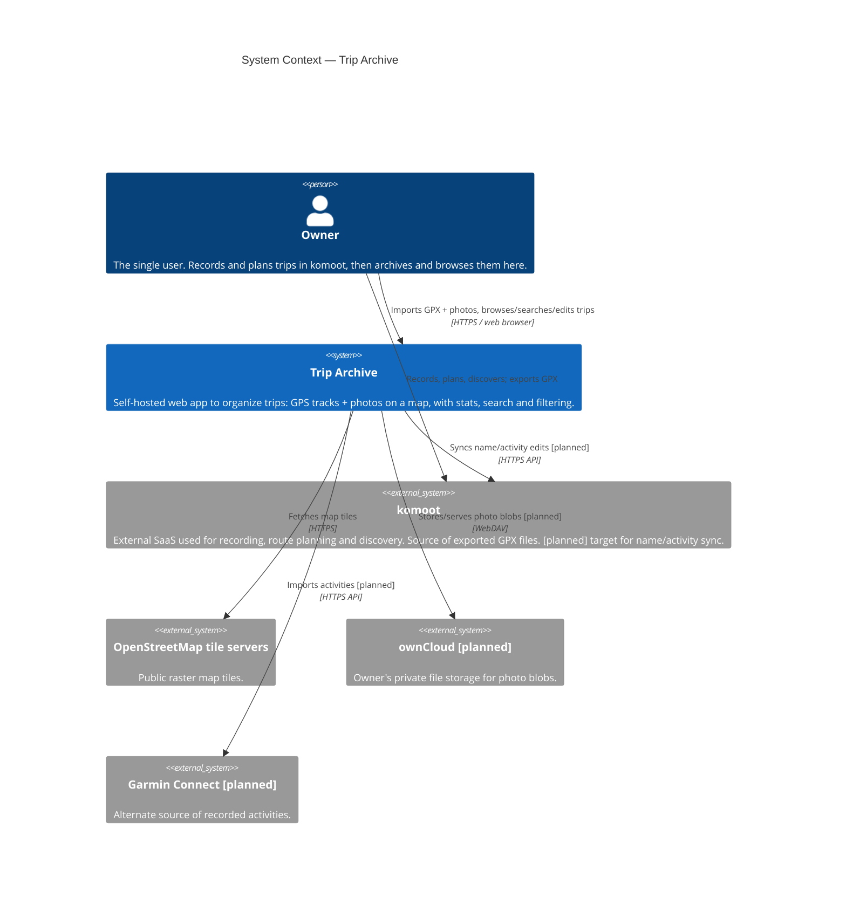
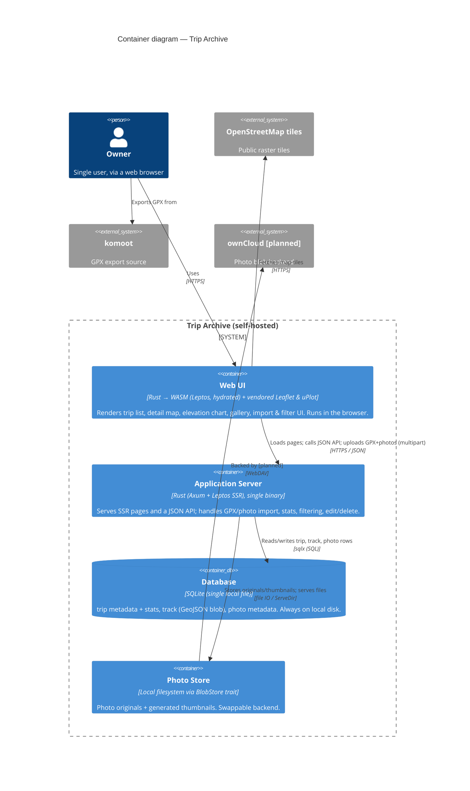
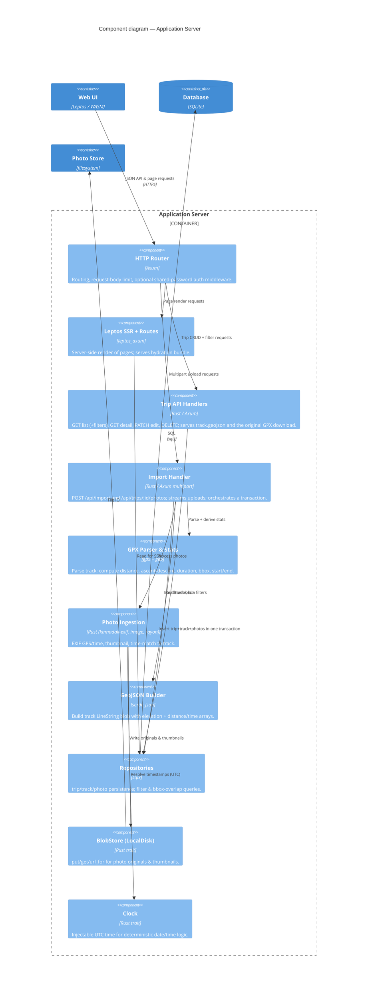
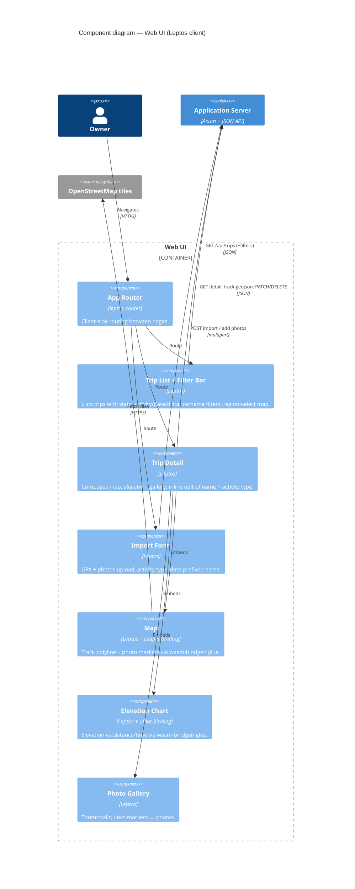

# Trip Archive — Architecture (C4 model)

This document describes the architecture using the [C4 model](https://c4model.com/): **Level 1
System Context**, **Level 2 Containers**, and **Level 3 Components**. Level 4 (code) is
intentionally omitted — the source is the code-level truth.

Diagrams are written in Mermaid C4 syntax (renders on GitHub). Companion docs:
[`requirements.md`](./requirements.md) · [`adr/`](./adr/) · [`initial_plan.md`](./initial_plan.md) (frozen).

Legend: solid = v1; elements/relationships marked **[planned]** are future extensions
(US-16–US-20) that the architecture must not preclude, not part of v1.

---

## Level 1 — System Context

Who uses the system and what it talks to.

**Notes**
- The owner keeps using komoot for recording/planning/discovery; Trip Archive only *organizes*
  exported trips. GPX export → import is the integration in v1.
- Map tiles come from OpenStreetMap directly (no API key) — see
  [ADR-0005](./adr/0005-leaflet-osm-via-wasm-interop.md).

---

## Level 2 — Containers

The deployable/runtime pieces inside Trip Archive and how they communicate. Everything runs on the
owner's self-hosted machine.

**Notes**
- The **track GeoJSON lives in the DB** (a blob in the `track` table), not in the photo store —
  see [ADR-0003](./adr/0003-track-as-geojson-blob-in-sqlite.md). Only photos are external blobs
  ([ADR-0007](./adr/0007-blobstore-abstraction.md)).
- The API is JSON-first so a future Android/PWA client is additive
  ([ADR-0008](./adr/0008-json-first-api.md)).

---

## Level 3 — Components

### 3a. Application Server components

**Notes**
- `BlobStore` and `Clock` are traits — the seams that get mocked/replaced: ownCloud as a future
  `BlobStore` impl ([ADR-0007](./adr/0007-blobstore-abstraction.md)), and the clock as the only
  time source so time-matching is deterministic and testable
  ([ADR-0009](./adr/0009-utc-timestamp-normalization.md), [ADR-0012](./adr/0012-tdd-test-strategy.md)).
- The photo half of the pipeline is shared between full import and "add photos later"
  ([ADR-0004](./adr/0004-import-via-axum-multipart.md)).
- Filtering and the geographic-region (bbox) query live in the repositories, against `trip`
  columns only ([ADR-0011](./adr/0011-filtering-search-geo-queries.md)).

### 3b. Web UI components

**Notes**
- Map and chart are thin Leptos wrappers over vendored JS (Leaflet, uPlot) through wasm-bindgen
  glue; map/chart code runs client-side only ([ADR-0005](./adr/0005-leaflet-osm-via-wasm-interop.md),
  [ADR-0006](./adr/0006-uplot-elevation-chart.md)).
- Reusable logic (stats, EXIF decode, time-match, bbox) lives in plain Rust modules on the server
  side, keeping these view components thin and the logic unit-testable
  ([ADR-0001](./adr/0001-rust-leptos-fullstack.md), [ADR-0012](./adr/0012-tdd-test-strategy.md)).

---

## Diagram ↔ decision map

| C4 element | Backing decision |
|------------|------------------|
| OSM tiles, Map component | [ADR-0005](./adr/0005-leaflet-osm-via-wasm-interop.md) |
| Elevation Chart | [ADR-0006](./adr/0006-uplot-elevation-chart.md) |
| Database container; track blob | [ADR-0002](./adr/0002-sqlite-local-disk.md), [ADR-0003](./adr/0003-track-as-geojson-blob-in-sqlite.md) |
| Photo Store / BlobStore | [ADR-0007](./adr/0007-blobstore-abstraction.md) |
| Import Handler / Photo Ingestion | [ADR-0004](./adr/0004-import-via-axum-multipart.md) |
| Trip API Handlers (JSON) | [ADR-0008](./adr/0008-json-first-api.md) |
| Clock seam (UTC) | [ADR-0009](./adr/0009-utc-timestamp-normalization.md) |
| Auth middleware | [ADR-0010](./adr/0010-single-user-optional-auth.md) |
| Filter/region queries in Repositories | [ADR-0011](./adr/0011-filtering-search-geo-queries.md) |
| Trait seams as test mocks | [ADR-0012](./adr/0012-tdd-test-strategy.md) |
