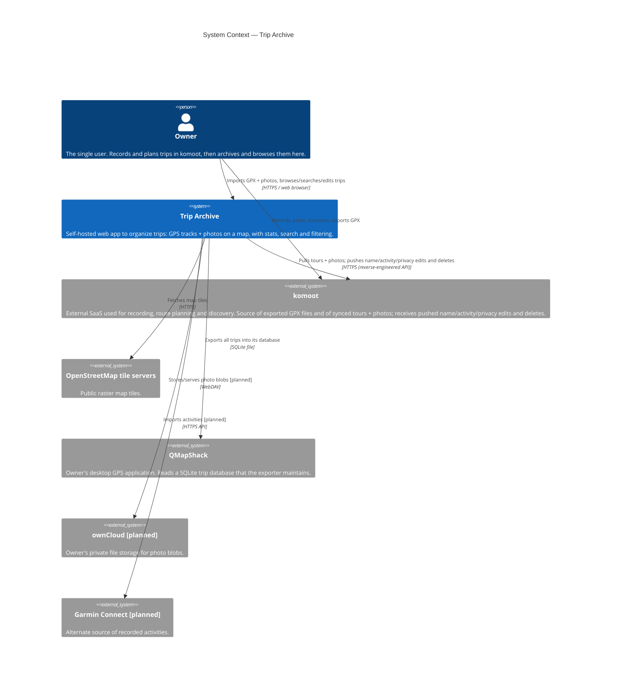
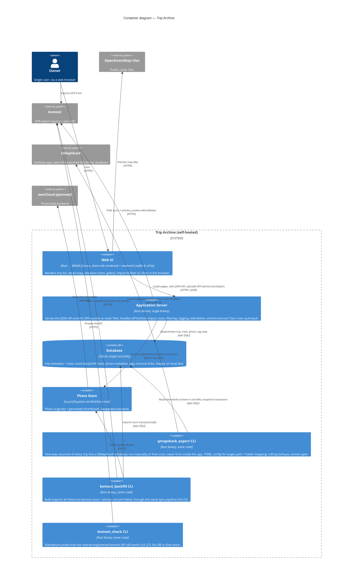
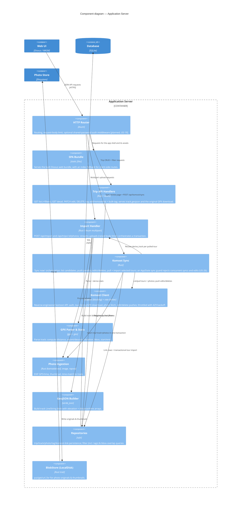
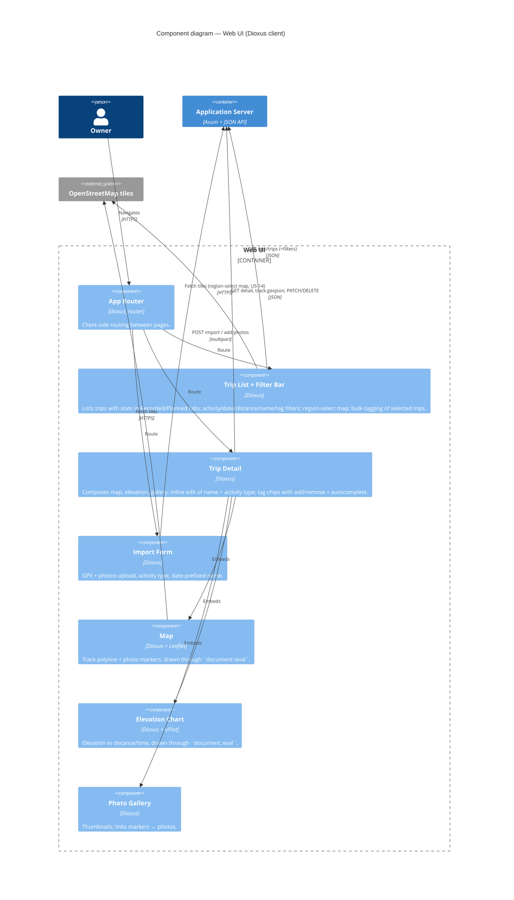

# Trip Archive — Architecture (C4 model)

This document describes the architecture using the [C4 model](https://c4model.com/): **Level 1
System Context**, **Level 2 Containers**, and **Level 3 Components**. Level 4 (code) is
intentionally omitted — the source is the code-level truth.

Diagrams are written in Mermaid C4 syntax (renders on GitHub). Companion docs:
[`requirements.md`](./requirements.md) · [`adr/`](./adr/) · [`initial_plan.md`](./initial_plan.md) (frozen).

Legend: solid = v1; elements/relationships marked **[planned]** are future extensions
that the architecture must not preclude, not part of v1.

**Target vs. current UI:** the Web UI container and its components show the *target* stack
([ADR-0024](./adr/0024-dioxus-ui-web-and-android.md): a client-side-rendered Dioxus SPA served as
static files, plus an Android app from the same source). That SPA now exists as
`crates/ui-dioxus` and is served at `/app`, with the **trip-list screen** complete — browsing,
filtering, tagging and the region map (US-41, US-52). `/` redirects to it: the server-rendered
list page has been deleted, its acceptance assertions having moved to the SPA and the JSON API
under [ADR-0012](./adr/0012-tdd-test-strategy.md)'s migration rule.

What remains of the intentionally throwaway proof-of-concept is the trip detail, import and
Komoot-sync pages, still reachable and still how the owner does that work until US-42/43/44
replace them; the SPA links out to them. They are retired the same way, page by page.

---

## Level 1 — System Context

Who uses the system and what it talks to.

```mermaid
C4Context
    title System Context — Trip Archive

    Person(owner, "Owner", "The single user. Records and plans trips in komoot, then archives and browses them here.")

    System(tripArchive, "Trip Archive", "Self-hosted web app to organize trips: GPS tracks + photos on a map, with stats, search and filtering.")

    System_Ext(komoot, "komoot", "External SaaS used for recording, route planning and discovery. Source of exported GPX files and of synced tours + photos; receives pushed name/activity/privacy edits and deletes.")
    System_Ext(osm, "OpenStreetMap tile servers", "Public raster map tiles.")
    System_Ext(qms, "QMapShack", "Owner's desktop GPS application. Reads a SQLite trip database that the exporter maintains.")
    System_Ext(owncloud, "ownCloud [planned]", "Owner's private file storage for photo blobs.")
    System_Ext(garmin, "Garmin Connect [planned]", "Alternate source of recorded activities.")

    Rel(owner, komoot, "Records, plans, discovers; exports GPX")
    Rel(owner, tripArchive, "Imports GPX + photos, browses/searches/edits trips", "HTTPS / web browser")
    Rel(tripArchive, osm, "Fetches map tiles", "HTTPS")
    Rel(tripArchive, owncloud, "Stores/serves photo blobs [planned]", "WebDAV")
    Rel(tripArchive, garmin, "Imports activities [planned]", "HTTPS API")
    Rel(tripArchive, komoot, "Pulls tours + photos; pushes name/activity/privacy edits and deletes", "HTTPS (reverse-engineered API)")
    Rel(tripArchive, qms, "Exports all trips into its database", "SQLite file")

    UpdateLayoutConfig($c4ShapeInRow="2", $c4BoundaryInRow="1")
```

**Notes**
- The owner keeps using komoot for recording/planning/discovery; Trip Archive *organizes* the
  trips. Manual GPX export → import was the v1 integration; since US-20/US-22–US-27 the app also
  talks to komoot's (reverse-engineered) API directly: it pulls selected or all historical tours
  with their photos, and pushes the owner's name/activity edits and deletes back
  ([ADR-0021](./adr/0021-reverse-engineered-komoot-client.md)).
- The QMapShack export is one-way and runs outside the web app, as a CLI the owner invokes
  manually or from cron (US-36/US-37, [ADR-0022](./adr/0022-qmapshack-export.md)).
- Map tiles come from OpenStreetMap directly (no API key) — see
  [ADR-0005](./adr/0005-leaflet-osm-via-wasm-interop.md).

---

## Level 2 — Containers

The deployable/runtime pieces inside Trip Archive and how they communicate. Everything runs on the
owner's self-hosted machine.

```mermaid
C4Container
    title Container diagram — Trip Archive

    Person(owner, "Owner", "Single user, via a web browser")

    System_Boundary(ta, "Trip Archive (self-hosted)") {
        Container(spa, "Web UI", "Rust → WASM (Dioxus, client-side rendered) + vendored Leaflet & uPlot", "Renders trip list, detail map, elevation chart, gallery, import & filter UI. Runs in the browser.")
        Container(server, "Application Server", "Rust (Axum), single binary", "Serves the JSON API and the SPA bundle as static files; handles GPX/photo import, stats, filtering, tagging, edit/delete, and the komoot 'Sync now' push/pull.")
        ContainerDb(db, "Database", "SQLite (single local file)", "trip metadata + stats, track (GeoJSON blob), photo metadata, tags, komoot links. Always on local disk.")
        Container(blobs, "Photo Store", "Local filesystem via BlobStore trait", "Photo originals + generated thumbnails. Swappable backend.")
        Container(qmsexport, "qmapshack_export CLI", "Rust binary, same crate", "One-way reconcile of every trip into a QMapShack database; run manually or from cron, never from inside the app. TOML config for target path + folder mapping; rolling backups; version gate.")
        Container(backfill, "komoot_backfill CLI", "Rust binary, same crate", "Bulk-imports all historical komoot tours + photos not yet linked, through the same sync pipeline (US-23).")
        Container(check, "komoot_check CLI", "Rust binary, same crate", "Standalone probe that the reverse-engineered komoot API still works (US-27). No DB or blob store.")
    }

    System_Ext(osm, "OpenStreetMap tiles", "Public raster tiles")
    System_Ext(komoot, "komoot", "GPX export source + sync API")
    System_Ext(qms, "QMapShack", "Desktop app; owns the exported SQLite trip database")
    System_Ext(owncloud, "ownCloud [planned]", "Photo blob backend")

    Rel(owner, spa, "Uses", "HTTPS")
    Rel(owner, komoot, "Exports GPX from")
    Rel(spa, server, "Loads pages; calls JSON API; uploads GPX+photos (multipart)", "HTTPS / JSON")
    Rel(server, db, "Reads/writes trip, track, photo, tag rows", "sqlx (SQL)")
    Rel(server, blobs, "Stores originals/thumbnails; serves files", "file IO / ServeDir")
    Rel(server, komoot, "Pulls tours + photos; pushes edits/deletes", "HTTPS")
    Rel(spa, osm, "Fetches map tiles", "HTTPS")
    Rel(qmsexport, db, "Reads the whole archive in one WAL-snapshot transaction", "sqlx (SQL)")
    Rel(qmsexport, qms, "Inserts/updates/trashes items in its database", "SQLite file IO")
    Rel(backfill, komoot, "Lists + downloads tours and photos", "HTTPS")
    Rel(backfill, db, "Imports tours transactionally", "sqlx (SQL)")
    Rel(backfill, blobs, "Stores pulled photos", "file IO")
    Rel(check, komoot, "Probes the API", "HTTPS")
    Rel(blobs, owncloud, "Backed by [planned]", "WebDAV")

    UpdateLayoutConfig($c4ShapeInRow="2", $c4BoundaryInRow="1")
```

**Notes**
- The **track GeoJSON lives in the DB** (a blob in the `track` table), not in the photo store —
  see [ADR-0003](./adr/0003-track-as-geojson-blob-in-sqlite.md). Only photos are external blobs
  ([ADR-0007](./adr/0007-blobstore-abstraction.md)).
- The API is JSON-first so a future Android/PWA client is additive
  ([ADR-0008](./adr/0008-json-first-api.md)).
- The three CLI binaries are thin shells over the same library crate as the server — same
  repositories, same import pipeline — and open the same SQLite file directly. Consistency
  differs by process: inside the server, an in-process sync guard serializes "Sync now" against
  edits/deletes (US-26); the out-of-process exporter instead reads the archive through a single
  WAL-snapshot transaction ([ADR-0022](./adr/0022-qmapshack-export.md)).

---

## Level 3 — Components

### 3a. Application Server components

```mermaid
C4Component
    title Component diagram — Application Server

    Container(spa, "Web UI", "Dioxus / WASM")
    ContainerDb(db, "Database", "SQLite")
    Container(blobs, "Photo Store", "filesystem")

    Container_Boundary(server, "Application Server") {
        Component(router, "HTTP Router", "Axum", "Routing, request-body limit, optional shared-password auth middleware [planned, US-19].")
        Component(spaassets, "SPA Bundle", "static files", "Serves the built Dioxus web bundle, with an index fallback for client-side routes.")
        Component(api, "Trip API Handlers", "Rust / Axum", "GET list (+filters), GET detail, PATCH edit, DELETE; tag add/remove/list + bulk-tag; serves track.geojson and the original GPX download.")
        Component(import, "Import Handler", "Rust / Axum multipart", "POST /api/import and /api/trips/:id/photos; streams uploads (raised body limit); orchestrates a transaction.")
        Component(sync, "Komoot Sync", "Rust", "'Sync now' orchestration: list candidates, push pending edits/deletes, pull + import selected tours; an AppState sync guard rejects concurrent syncs and edits (US-26).")
        Component(komootc, "Komoot Client", "reqwest (blocking) + rate limiter", "Reverse-engineered komoot API: auth, tour listing/GPX download, photo fetch, edit/delete pushes; throttled with 429 backoff.")
        Component(gpx, "GPX Parser & Stats", "gpx + geo", "Parse track; compute distance, ascent/descent, duration, bbox, start/end.")
        Component(photo, "Photo Ingestion", "Rust (kamadak-exif, image, rayon)", "EXIF GPS/time, thumbnail, time-match to track.")
        Component(geojson, "GeoJSON Builder", "serde_json", "Build track LineString blob with elevation + distance/time arrays.")
        Component(repo, "Repositories", "sqlx", "trip/track/photo/tag/komoot-link persistence; filter (incl. tags) & bbox-overlap queries.")
        Component(store, "BlobStore (LocalDisk)", "Rust trait", "put/get/url_for for photo originals & thumbnails.")
    }

    Rel(spa, router, "JSON API requests", "HTTPS")
    Rel(router, spaassets, "Requests for the app shell and its assets")
    Rel(router, api, "Trip CRUD + filter requests")
    Rel(router, import, "Multipart upload requests")

    Rel(router, sync, "Sync review page + POST /api/komoot/sync")
    Rel(import, gpx, "Parse + derive stats")
    Rel(import, photo, "Process photos")
    Rel(import, geojson, "Build track blob")
    Rel(import, repo, "Insert trip+track+photos in one transaction")
    Rel(sync, komootc, "List/pull tours + photos; push edits/deletes")
    Rel(sync, import, "Reuses derive_track per pulled tour")
    Rel(sync, photo, "Ingests pulled photos")
    Rel(sync, repo, "Link rows + transactional tour import")
    Rel(photo, store, "Write originals & thumbnails")
    Rel(api, repo, "Read/write; run filters")
    Rel(repo, db, "SQL", "sqlx")
    Rel(store, blobs, "File IO")

    UpdateLayoutConfig($c4ShapeInRow="3", $c4BoundaryInRow="1")
```

**Notes**
- `BlobStore` and `KomootClient` are traits — the seams that get mocked/replaced: ownCloud as a
  future `BlobStore` impl ([ADR-0007](./adr/0007-blobstore-abstraction.md)), and `KomootClient`
  as the external-API mock in the sync tests
  ([ADR-0021](./adr/0021-reverse-engineered-komoot-client.md), [ADR-0012](./adr/0012-tdd-test-strategy.md)).
- There is no clock abstraction: photo time-matching needs only EXIF and track timestamps, so
  wall-clock time is read once at a boundary (`OffsetDateTime::now_utc()`) and passed as a plain
  value into the pure logic — the injectable-clock seam originally anticipated by ADR-0012
  turned out unnecessary ([ADR-0009](./adr/0009-utc-timestamp-normalization.md)).
- The photo half of the pipeline is shared between full import, "add photos later", and the
  komoot pull ([ADR-0004](./adr/0004-import-via-axum-multipart.md)).
- Filtering, the tag filter, and the geographic-region (bbox) query live in the repositories,
  against `trip` columns and the tag join only
  ([ADR-0011](./adr/0011-filtering-search-geo-queries.md)).

### 3b. Web UI components

```mermaid
C4Component
    title Component diagram — Web UI (Dioxus client)

    Person(owner, "Owner")
    Container(server, "Application Server", "Axum + JSON API")
    System_Ext(osm, "OpenStreetMap tiles")

    Container_Boundary(spa, "Web UI") {
        Component(approuter, "App Router", "dioxus_router", "Client-side routing between pages.")
        Component(list, "Trip List + Filter Bar", "Dioxus", "Lists trips with stats in Recorded/Planned tabs; activity/date/distance/name/tag filters; region-select map; bulk-tagging of selected trips.")
        Component(detail, "Trip Detail", "Dioxus", "Composes map, elevation, gallery; inline edit of name + activity type; tag chips with add/remove + autocomplete.")
        Component(importform, "Import Form", "Dioxus", "GPX + photos upload, activity type, date-prefixed name.")
        Component(map, "Map", "Dioxus + Leaflet", "Track polyline + photo markers, drawn through `document::eval`.")
        Component(elev, "Elevation Chart", "Dioxus + uPlot", "Elevation vs distance/time, drawn through `document::eval`.")
        Component(gallery, "Photo Gallery", "Dioxus", "Thumbnails; links markers ↔ photos.")
    }

    Rel(owner, approuter, "Navigates", "HTTPS")
    Rel(approuter, list, "Route")
    Rel(approuter, detail, "Route")
    Rel(approuter, importform, "Route")
    Rel(detail, map, "Embeds")
    Rel(detail, elev, "Embeds")
    Rel(detail, gallery, "Embeds")

    Rel(list, server, "GET /api/trips (+filters)", "JSON")
    Rel(detail, server, "GET detail, track.geojson; PATCH/DELETE", "JSON")
    Rel(importform, server, "POST import / add photos", "multipart")
    Rel(map, osm, "Fetch tiles", "HTTPS")
    Rel(list, osm, "Fetch tiles (region-select map, US-14)", "HTTPS")

    UpdateLayoutConfig($c4ShapeInRow="3", $c4BoundaryInRow="1")
```

**Notes**
- Map and chart are thin Dioxus wrappers over vendored JS (Leaflet, uPlot), driven through
  `document::eval` so the same code runs on the web and in the Android WebView; map/chart code
  runs client-side only ([ADR-0025](./adr/0025-js-widget-interop-via-eval.md)).
- The same components build for Android ([ADR-0024](./adr/0024-dioxus-ui-web-and-android.md)); the
  shared data models live in their own crate (`crates/types`, free of server dependencies — the
  SQLite mappings sit behind a feature only the server enables) so server and UI describe trips
  with one set of types rather than mirroring shapes by hand
  ([ADR-0015](./adr/0015-db-model-response-type-separation.md)).
- **Built so far:** the App Router and the Trip List — filter bar, tag filter, bulk-tagging and
  the region-select map (US-41, US-52). The remaining components arrive with US-42/43/44.
- The list screen's filters live in the SPA's own URL query, so a narrowed list is bookmarkable
  and survives a reload, and the region rectangle can be restored onto the map (US-52). The map
  reports each dragged rectangle back into Rust state over `document::eval`'s channel — the
  sustained two-way interaction [ADR-0025](./adr/0025-js-widget-interop-via-eval.md) named as
  its own revisit trigger, spiked before implementation and found to hold
  ([eval-two-way-spike.md](./eval-two-way-spike.md)).
- Reusable logic (stats, EXIF decode, time-match, bbox) lives in plain Rust modules on the server
  side, keeping these view components thin and the logic unit-testable
  ([ADR-0012](./adr/0012-tdd-test-strategy.md)).

---

## Diagram ↔ decision map

| C4 element | Backing decision |
|------------|------------------|
| OSM tiles, Map component | [ADR-0005](./adr/0005-leaflet-osm-via-wasm-interop.md) |
| Elevation Chart | [ADR-0006](./adr/0006-uplot-elevation-chart.md) |
| Database container; track blob | [ADR-0002](./adr/0002-sqlite-local-disk.md), [ADR-0003](./adr/0003-track-as-geojson-blob-in-sqlite.md) |
| Photo Store / BlobStore | [ADR-0007](./adr/0007-blobstore-abstraction.md) |
| Import Handler / Photo Ingestion | [ADR-0004](./adr/0004-import-via-axum-multipart.md) |
| Trip API Handlers (JSON) | [ADR-0008](./adr/0008-json-first-api.md) |
| Clock seam (UTC) | [ADR-0009](./adr/0009-utc-timestamp-normalization.md) |
| Auth middleware | [ADR-0010](./adr/0010-single-user-optional-auth.md) |
| Filter/region queries in Repositories | [ADR-0011](./adr/0011-filtering-search-geo-queries.md) |
| Trait seams as test mocks | [ADR-0012](./adr/0012-tdd-test-strategy.md) |
| Static assets served next to the binary | [ADR-0016](./adr/0016-assets-relative-to-executable.md) |
| Photo Ingestion — EXIF GPS extraction | [ADR-0017](./adr/0017-kamadak-exif-for-gps-extraction.md) |
| Activity/kind wire values in API + forms | [ADR-0018](./adr/0018-enums-for-closed-string-sets.md) |
| Photo Ingestion — timezone lookup | [ADR-0019](./adr/0019-tzf-rs-time-tz-for-timezone-lookup.md) |
| Photo Ingestion — thumbnails | [ADR-0020](./adr/0020-image-crate-for-thumbnails.md) |
| Komoot Client + Komoot Sync; backfill/check CLIs | [ADR-0021](./adr/0021-reverse-engineered-komoot-client.md) |
| qmapshack_export CLI; QMapShack database | [ADR-0022](./adr/0022-qmapshack-export.md) |

See [`deployment.md`](./deployment.md) for how to build and run a self-hosted instance (US-10).
